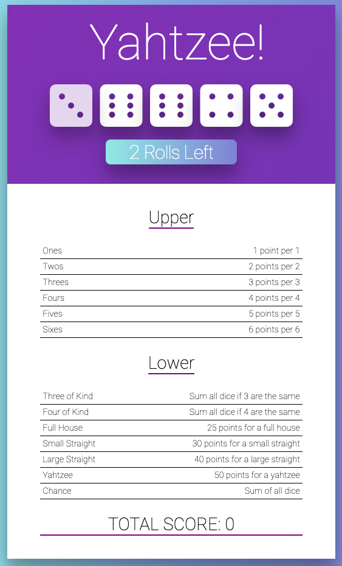

# yahtzee

The To-do project as part of [Colt Steele's The Modern React Bootcamp](https://www.udemy.com/modern-react-bootcamp/) course.

This project provides more practice working with reusable components, passing props, keys, etc.

## How to run the app

### Clone the repo:

`git clone https://github.com/ryanfuhrman/yahtzee.git`

###Navigate into the directory `cd yahtzee`

### Install dependencies

If using `npm`:

`npm install` or `npm i`

If using `yarn`:

`yarn install`

### Start up the client

For `npm`:

`npm run start`

For `yarn`:

`yarn start`

### Open the site

Visit `localhost:3000/` in the browser of your choice.
